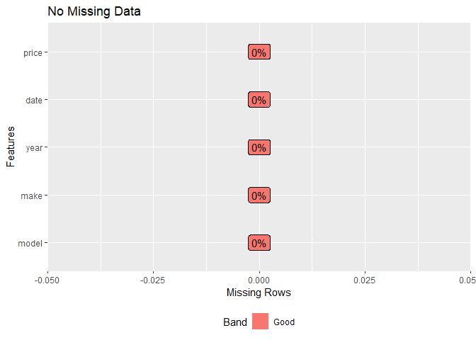
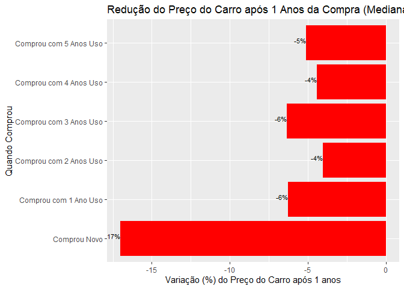
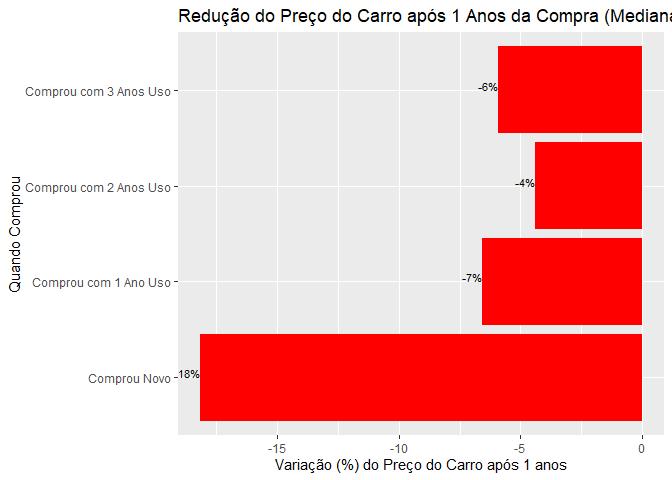
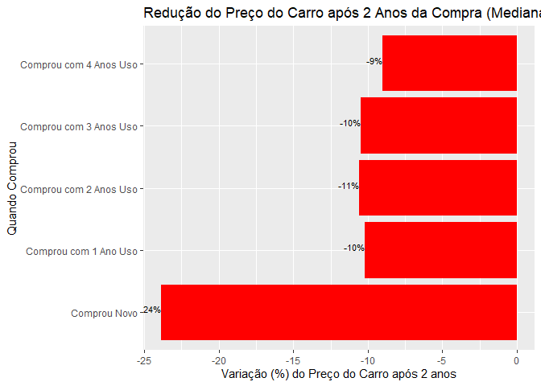

Carro Comprar (Financiado x não)
Novo ou seminovo?
ou Alugar?
================
Felipe
2020/09/13

##### Utilizaremos os dados da tabela FIPE de veículos.

##### A Fundação Instituto de Pesquisas Econômicas - FIPE é um órgão de apoio institucional ao Departamento de Economia da Faculdade de Economia, Administração e Contabilidade (FEA) da Universidade de São Paulo (USP). Um dos índices mais conhecidos e usados no Brasil é a Tabela FIPE Veículos que é atualizada todos os meses com o valor médio de venda de veículos. \[Wikipedia\]

Carregando Bibliotecas
----------------------

``` r
#library(readr)
library(magrittr) #uso do pipe
library(dplyr) #manipulação dados
library(ggplot2)
#library(plotly)
library(fipe)
library(DataExplorer)
```

### Carregando Dados

``` r
data_vehicules <-
  readr::read_rds("data/2020_09_fipe_top_veiculos.rds")
```

### Filtrando modelos que tem valor de 0km e são abaixo 55mil reais

``` r
modelos_abaixo_55 <- 
  data_vehicules %>% 
  filter(year=="0 km") %>% 
  filter(price<55000) %>% 
  pull(model)


#modelos_tem_0km <- 
 # data_vehicules %>% filter(year=="0 km") %>% pull(model)


data_vehicules <- data_vehicules %>% 
                    filter((model %in% modelos_abaixo_55)) %>%
                    distinct()
```

### Descrição do dataset

#### model: O modelo do carro (Ex: Etios 1.3 Flex )

#### date: data Ano/meda avaliação na FIPE (Ex: 2020-09-01)

#### make: fabricante (Ex: Toyota)

#### price: preço em reais na coluna price (Ex: 36500)

``` r
glimpse(data_vehicules )
```

    ## Rows: 140
    ## Columns: 5
    ## $ model <chr> "ETIOS X 1.3 Flex 16V 5p Mec.", "ETIOS X 1.3 Flex 16V 5p Mec....
    ## $ make  <chr> "Toyota", "Toyota", "Toyota", "Toyota", "Toyota", "Toyota", "...
    ## $ year  <fct> 0 km, 2014, 2015, 2016, 2017, 2018, 2019, 0 km, 2015, 2016, 2...
    ## $ date  <date> 2020-09-01, 2020-09-01, 2020-09-01, 2020-09-01, 2020-09-01, ...
    ## $ price <dbl> 52710, 28978, 31007, 32560, 34372, 36353, 38913, 49547, 31013...

``` r
plot_missing(data_vehicules, title="No Missing Data")
```



#### Carros mais baratos do Brasil hoje

``` r
data_vehicules %>% filter(year=="0 km") %>% 
  arrange(price) %>% 
  select(model, make, price)
```

    ## # A tibble: 40 x 3
    ##    model                               make    price
    ##    <chr>                               <chr>   <dbl>
    ##  1 KWID Life 1.0 Flex 12V 5p Mec.      Renault 34319
    ##  2 QQ 1.0 Look FL 12V/1.0 12V Flex 5p  CHERY   34455
    ##  3 QQ 1.0  ACT FL 12V/1.0 12V Flex  5p CHERY   34745
    ##  4 MOBI EASY 1.0 Fire Flex 5p.         Fiat    35060
    ##  5 MOBI EASY COMFORT 1.0 Flex 5p.      Fiat    36832
    ##  6 MOBI LIKE 1.0 Fire Flex 5p.         Fiat    40602
    ##  7 KWID Zen 1.0 Flex 12V 5p Mec.       Renault 41323
    ##  8 MOBI WAY 1.0 Fire Flex 5p.          Fiat    41992
    ##  9 Kwid ConnecTV 1.0 Flex 12V Mec.     Renault 42289
    ## 10 530 TALENT 1.5 16V 103cv 4p         LIFAN   43245
    ## # ... with 30 more rows

#### Carros com 7 anos histórico

``` r
#Carros com dados de todos anos
carros_completos <- data_vehicules %>%
  group_by(model) %>% 
  count(sort=TRUE)  

#mostrando carros com dados completos
carros_completos7 <- carros_completos %>%
    filter(n==7)
carros_completos7
```

    ## # A tibble: 4 x 2
    ## # Groups:   model [4]
    ##   model                                      n
    ##   <chr>                                  <int>
    ## 1 ETIOS X 1.3 Flex 16V 5p Mec.               7
    ## 2 Grand Siena ATTRAC. 1.4 EVO F.Flex 8V      7
    ## 3 ONIX HATCH LT 1.0 8V FlexPower 5p Mec.     7
    ## 4 ONIX HATCH LT 1.4 8V FlexPower 5p Mec.     7

#### Filtrnado carro com pelo menos 0km +2019

``` r
data_vehicules <- 
  data_vehicules %>%
  filter(model %in% (carros_completos %>% filter(n>1) %>% pull(model)))
```

#### Carros com 5 anos histórico

``` r
carros_completos5 <- carros_completos %>%
  filter(n>=5)
carros_completos5
```

    ## # A tibble: 10 x 2
    ## # Groups:   model [10]
    ##    model                                      n
    ##    <chr>                                  <int>
    ##  1 ETIOS X 1.3 Flex 16V 5p Mec.               7
    ##  2 Grand Siena ATTRAC. 1.4 EVO F.Flex 8V      7
    ##  3 ONIX HATCH LT 1.0 8V FlexPower 5p Mec.     7
    ##  4 ONIX HATCH LT 1.4 8V FlexPower 5p Mec.     7
    ##  5 Ka 1.0 SE/SE Plus TiVCT Flex 5p            6
    ##  6 Ka+ Sedan 1.0 SE/SE PLUS TiVCT Flex 4p     6
    ##  7 MARCH SV 1.0 12V Flex 5p                   6
    ##  8 QQ 1.0  ACT FL 12V/1.0 12V Flex  5p        6
    ##  9 QQ 1.0 Look FL 12V/1.0 12V Flex 5p         6
    ## 10 530 TALENT 1.5 16V 103cv 4p                5

``` r
#Função calcula variacao apos x anos uso
variacao_ano <- function(df,df_completo , n_lag =1){
 df %>% 
  semi_join(df_completo , by="model") %>% 
   mutate(year =case_when( 
              year=="0 km" ~ "N_0",
              year=="2019" ~ "N_1",
              year=="2018" ~ "N_2",
              year=="2017" ~ "N_3",
              year=="2016" ~ "N_4",
              year=="2015" ~ "N_5",
              year=="2014" ~ "N_6",
              TRUE ~NA_character_)) %>% 
  arrange(model,year) %>% 
  #tidyr::pivot_wider(names_from = year, values_from=price ) %>%
  #data.frame() %>% 
  #filter(!is.na(N_6), !is.na(N_0)) %>% 
  group_by(model) %>% 
  mutate(pct_change = (lead(price,n_lag)/price - 1) * 100,
         custo_depreciacao = price-lead(price,n_lag)) %>% 
  mutate(year = 
           forcats::fct_recode(year,
                      "Comprou Novo" = "N_0",
                      "Comprou com 1 Ano Uso" = "N_1",
                      "Comprou com 2 Anos Uso" = "N_2",
                      "Comprou com 3 Anos Uso" = "N_3",
                      "Comprou com 4 Anos Uso" = "N_4",
                      "Comprou com 5 Anos Uso" = "N_5")) %>% 
  filter(! is.na(pct_change ))
  }
```

### Variação Preço Carro Após 1 Anos Compra (n=4)

``` r
variacao_ano(data_vehicules,carros_completos7, 1) %>% 
  group_by(year) %>% 
  summarize(pct_change = median(pct_change)) %>% 
  ggplot(aes(x=year, y=pct_change)) +
  geom_bar(stat = 'identity', fill="red")+
  labs(title= "Redução do Preço do Carro após 1 Anos da Compra (Mediana)",
       y="Variação (%) do Preço do Carro após 1 anos", 
       x="Quando Comprou")+
   geom_text(aes(label=paste0(round(pct_change,0), "%")), vjust=0, hjust=1, size=3) +
   coord_flip()
```

    ## `summarise()` ungrouping output (override with `.groups` argument)



### Variação Preço Carro Após 1 Anos Compra

### (Carros com 5 anos histórico) (n=10)

``` r
variacao_ano(data_vehicules,carros_completos5 ,1) %>% 
  group_by(year) %>% 
  summarize(pct_change = median(pct_change)) %>% 
    filter(!year =="Comprou com 5 Anos Uso") %>% 
  filter(!year =="Comprou com 4 Anos Uso") %>% 
  ggplot(aes(x=year, y=pct_change)) +
  geom_bar(stat = 'identity', fill="red")+
  labs(title= "Redução do Preço do Carro após 1 Anos da Compra (Mediana)",
       y="Variação (%) do Preço do Carro após 1 anos", 
       x="Quando Comprou")+
   geom_text(aes(label=paste0(round(pct_change,0), "%")), vjust=0, hjust=1, size=3) +
   coord_flip()
```

    ## Warning: Unknown levels in `f`: N_3

    ## `summarise()` ungrouping output (override with `.groups` argument)



### Variação Preço Carro Após 2 Anos Compra

### Histórico dos 4 Carros com Histórico completo

    ## `summarise()` ungrouping output (override with `.groups` argument)



``` r
###Box Plot Variação Preço Carro Após 1 Ano Compra
# variacao_ano(data_vehicules, carros_completos,1) %>% 
 # ggplot(aes(x=year, y=pct_change)) +
  #geom_boxplot() +
  #labs(title= "Redução do Preço do Carro após 1 Ano",
      # y="Variação do Preço do Carro após 1 ano", 
       #x="Ano Carro") #+ 
  #theme(axis.text.x = element_text(angle = 30))
```

### Considerando Selic 2% e 15% Impostos

``` r
####Considerando Selic 2% e 15% Impostos
#IPVA utilizei Carros movidos a gasolina e biocombustíveis 4%
#custo seguro 0.065 até 0.08
#ipva dpvat ver por estado . Normalmente, para carros, ela é de 2% a 4%
#financiamento 20% entrada e 19.46% (media brasil ano)
#manuntencao 0.01 1o ano #0.02 2o ano #0.03 3o e 4o ano
#considerando uso até 1500km/mes

taxa_ipva = 0.04
taxa_selic =0.02

custos_carro <- variacao_ano(data_vehicules, carros_completos, 1) %>%
   # mutate(custo_depreciacao =  custo_depreciacao) %>%
  mutate(custo_nao_alocacao_selic = price* taxa_selic*0.85) %>% 
  mutate(custo_ipva_e_dpvat = price * taxa_ipva +5.23) %>% 
  mutate(custo_seguros = price * 0.07) %>% 
    #seguros  #0.03 a 0.04 muito barato e 0.09 caro
  mutate(custo_licenciamento_emplacamento = 93.87+138.94) %>%  # SP 
  mutate(custo_revisoes_manuntencao = 
           #https://autopapo.uol.com.br/noticia/valor-de-revisao-10-mais-vendidos/
           case_when(
           year == "Comprou Novo" ~ 0.01*price,
           year == "Comprou com 1 Ano Uso" ~ 0.01*price,
           year == "Comprou com 2 Anos Uso" ~ 0.02*price,
           year == "Comprou com 3 Anos Uso" ~ 0.03*price,
           year == "Comprou com 4 Anos Uso" ~ 0.03*price,
           TRUE ~ 0) 
  ) %>% 
  mutate(custo_juros_financiamento_1ano = price*0.1946*0.8 ) %>% 
  mutate(custo_juros_financiamento_2anos = price*0.1946*0.8 *0.7) %>% 
  mutate(custo_juros_financiamento_3anos = price*0.1946*0.8*0.7*0.7 ) %>% 
  mutate(custo_juros_financiamento_4anos = price*0.1946*0.8*0.7*0.7*0.7 ) %>% 
  mutate(custo_carro_mes  = 
           (custo_depreciacao +
           custo_nao_alocacao_selic +
           custo_ipva_e_dpvat+
           custo_seguros +
           custo_revisoes_manuntencao)/12
  ) %>% 
  mutate(custo_carro_mes = 
           ifelse(year == "Comprou Novo",
                      custo_carro_mes  +
                        custo_licenciamento_emplacamento/12,
           custo_carro_mes )
          
  ) 
```

    ## Warning: Unknown levels in `f`: N_3

    ## Warning: Unknown levels in `f`: N_3, N_4, N_5

    ## Warning: Unknown levels in `f`: N_3, N_4, N_5

    ## Warning: Unknown levels in `f`: N_3, N_4, N_5

    ## Warning: Unknown levels in `f`: N_2, N_3, N_4, N_5

    ## Warning: Unknown levels in `f`: N_4, N_5

    ## Warning: Unknown levels in `f`: N_3, N_4, N_5

    ## Warning: Unknown levels in `f`: N_3, N_4, N_5

    ## Warning: Unknown levels in `f`: N_3, N_4, N_5

    ## Warning: Unknown levels in `f`: N_3, N_4, N_5

    ## Warning: Unknown levels in `f`: N_4, N_5

    ## Warning: Unknown levels in `f`: N_3, N_4, N_5

    ## Warning: Unknown levels in `f`: N_4, N_5

    ## Warning: Unknown levels in `f`: N_2, N_3, N_4, N_5

    ## Warning: Unknown levels in `f`: N_4, N_5

    ## Warning: Unknown levels in `f`: N_4, N_5

    ## Warning: Unknown levels in `f`: N_3, N_4, N_5

    ## Warning: Unknown levels in `f`: N_2, N_3, N_4, N_5

    ## Warning: Unknown levels in `f`: N_2, N_3

    ## Warning: Unknown levels in `f`: N_3, N_4, N_5

    ## Warning: Unknown levels in `f`: N_4, N_5

    ## Warning: Unknown levels in `f`: N_4, N_5

``` r
#filtrar 1.0 ou custo novo <50mil e fazer mediana custo_mensal
#pegar comparar com 869,949 do unidas livre/mes
custos_carro %>% select(model, year, custo_carro_mes )
```

    ## # A tibble: 100 x 3
    ## # Groups:   model [31]
    ##    model                        year                   custo_carro_mes
    ##    <chr>                        <fct>                            <dbl>
    ##  1 530 TALENT 1.5 16V 103cv 4p  Comprou Novo                      905.
    ##  2 530 TALENT 1.5 16V 103cv 4p  Comprou com 1 Ano Uso             554.
    ##  3 530 TALENT 1.5 16V 103cv 4p  Comprou com 2 Anos Uso           1207.
    ##  4 530 TALENT 1.5 16V 103cv 4p  Comprou com 4 Anos Uso            621.
    ##  5 ARGO 1.0 6V Flex.            Comprou Novo                     1352.
    ##  6 ARGO 1.0 6V Flex.            Comprou com 1 Ano Uso             556.
    ##  7 ARGO DRIVE 1.0 6V Flex       Comprou Novo                     1623.
    ##  8 ARGO DRIVE 1.0 6V Flex       Comprou com 1 Ano Uso             619.
    ##  9 ETIOS X 1.3 Flex 16V 5p Mec. Comprou Novo                     1771.
    ## 10 ETIOS X 1.3 Flex 16V 5p Mec. Comprou com 1 Ano Uso             658.
    ## # ... with 90 more rows

``` r
#%>% 
 # mutate( custo_novo_financiado =
 # ) %>% 
 # mutate(custo_usado_financiado =)

#aluguel popular faixa 0.023 / mes
#kwid 40mil 38000 - > 0.023 879/38000 
#gol mpi 47mil e 949 -> 0.02  949/47000
#polo mpi 49000 1189/49000 0.024
```

### Qual carro sofre mais desvalorização (%) no 1o ano &lt;55mil

#### Verificamos que comprar carro novo tem um custo alto de redução após 1 ano. Certamente, você tem menos risco do carro ter problemas sendo o único e primeiro usuário, mas como negócio vale a pena comprar carro usado (nem que seja 1 ano ou menos) do que novo, sempre verificando o estado atual do carro e se foi feita as revisões.

``` r
#to do pegar qtdade carros vendidos
#http://www.fenabrave.org.br/portal/files/2020_08_2.pdf
```
